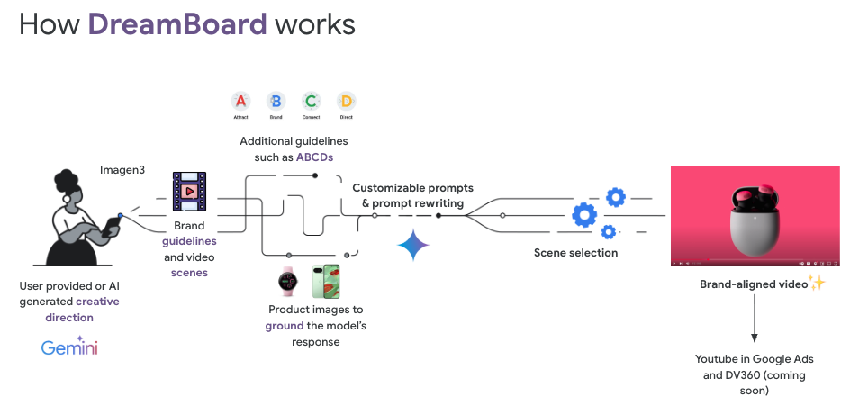

Copyright 2025 Google LLC

Licensed under the Apache License, Version 2.0 (the "License");
you may not use this file except in compliance with the License.
You may obtain a copy of the License at

    https://www.apache.org/licenses/LICENSE-2.0

Unless required by applicable law or agreed to in writing, software
distributed under the License is distributed on an "AS IS" BASIS,
WITHOUT WARRANTIES OR CONDITIONS OF ANY KIND, either express or implied.
See the License for the specific language governing permissions and
limitations under the License.

# Disclaimer

DreamBoard is NOT an officially supported Google product.

Copyright 2025 Google LLC. This solution, including any related sample code or data, is made available on an "as is", "as available", and "with all faults" basis, solely for illustrative purposes, and without warranty or representation of any kind. This solution is experimental, unsupported and provided solely for your convenience. Your use of it is subject to your agreements with Google, as applicable, and may constitute a beta feature as defined under those agreements. To the extent that you make any data available to Google in connection with your use of the solution, you represent and warrant that you have all necessary and appropriate rights, consents and permissions to permit Google to use and process that data. By using any portion of this solution, you acknowledge, assume and accept all risks, known and unknown, associated with its usage, including with respect to your deployment of any portion of this solution in your systems, or usage in connection with your business, if at all.

# Overview

DreamBoard is an AI-powered solution that generates high-quality video ads by combining AI capabilities with your brand's guidelines and creative direction. It uses a combination of the following AI products:
* Gemini for ideation and brainstorming, allowing users to generate detailed scenes descriptions and image prompts.
* Imagen for text-to-image generation or image editing using reference images.
* Veo for text-to-video and allows using seed images for image-to-video generation.

Other features include inputting brand guidelines for brand consistency, as well as using prompt rewriting and grounding techniques to refine the model’s output with realistic visuals.

The combination of the 3 AI products allows creation of ad videos from concept to storyboard to video generation.  As videos normally contain different scenes, DreamBoard allows creating videos of separate scenes, giving the user the opportunity to generate videos for that scene until it is suitable for the final video.  The scene videos are all stitched together in the end, creating the final video.  DreamBoard also includes post processing steps in the final video such as creating transitions between scenes, placement of logos and text (to be included soon).  The objective is to allow the user to be more creative by giving them greater control over each scene in the process.

# Why use DreamBoard

DreamBoard is the created as a end-to-end tool for AI-generated videos, based on Gemini, Imagen, and Veo.  Other than using them separately and utilizing each tool separately, the solution is a full workflow that utilizes all 3 at once.  Giving the choice of extra configuration settings from the backend APIs, it gives the user more freedom to get better results and enforce brand consistency using brand guidelines.

# How DreamBoard Works

DreamBoard contains a frontend and backend component.  The backend performs all the AI generation functions (text, image, video) and accessed through API calls.  The frontend is an Angular UI that stitches all the workflow steps together.  This decoupling allows developers who want to create their own frontend UI to just use the backend if needed.

# Limitations

# Requirements

Please refer to the README of the backend and frontend individually for requirements.

# Get Started

Please refer to the README of the backend and frontend individually for installation instructions.

# Pricing and Fees

# License

Apache 2.0

This is not an official Google product.
